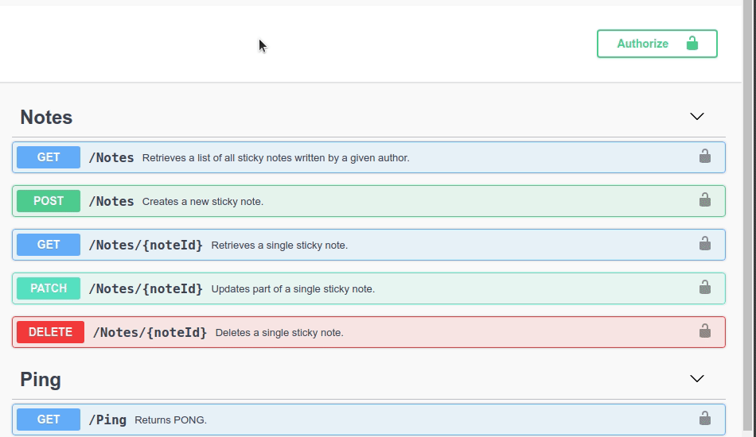

Web Hack: Sticky Notes
======================
_The best-of-breed cloud-based sticky note solution. Obviously not containing any security risks. To compete in the intertwingled world of tomorrow, we at Sticky Software Solutions™ are committed to delivering the best-of-breed cloud-based sticky note solution._

Getting started
---------------

### Cloning, building and running
Start by cloning this repo. Then navigate into the `web-hack/Notes.Api/` folder and start the application with `dotnet watch run`:
```shell
$ web-hack/Notes.Api> dotnet watch run
      Started
info: Microsoft.Hosting.Lifetime[0]
      Now listening on: https://localhost:5001
info: Microsoft.Hosting.Lifetime[0]
      Now listening on: http://localhost:5000
info: Microsoft.Hosting.Lifetime[0]
      Application started. Press Ctrl+C to shut down.
info: Microsoft.Hosting.Lifetime[0]
      Hosting environment: Development
info: Microsoft.Hosting.Lifetime[0]
      Content root path: /web-hack/Notes.Api
```

This should restore dependencies, build and start Notes.Api. Since we're using `watch`, Notes.Api should be recompiled and restarted whenever we change one of the source files in the /Notes.Api folder.

### Opening Notes.Client
Notes.Client is a static website, and it's hosted by Notes.Api. To open it, visit [localhost:5000/client](http://localhost:5000/client).


Initially, it won't show much, since we're currently not logged on to the Sticky Notes application. To logon, you'll need to press the "Login" button in the upper right corner, and enter a valid username and password.


### Working with Notes.Api in Swagger UI
You can access Notes.Api directly through [Swagger UI](https://swagger.io/tools/swagger-ui/). This gives you the option to craft requests and send them directly to the API, without using Notes.Client. To open Swagger UI, visit [localhost:5000/swagger](http://localhost:5000/swagger).


In order to make any requests to the API, you first need to authorize, using av valid username and password. To authorize, press the "Authorize" button, and enter a valid username and password.



### Ready for some hacking?
With everything set up and working properly, you're ready to start on the workshop. The workshop is divided into sections under the /Documents folder. Start by navigating to [0_INTRODUCTION.md](Documents/0_INTRODUCTION.md), and go on from there.